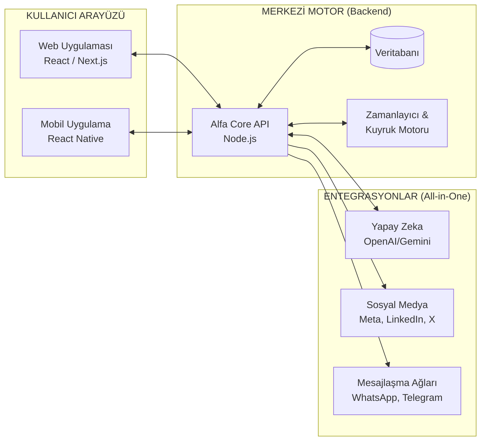
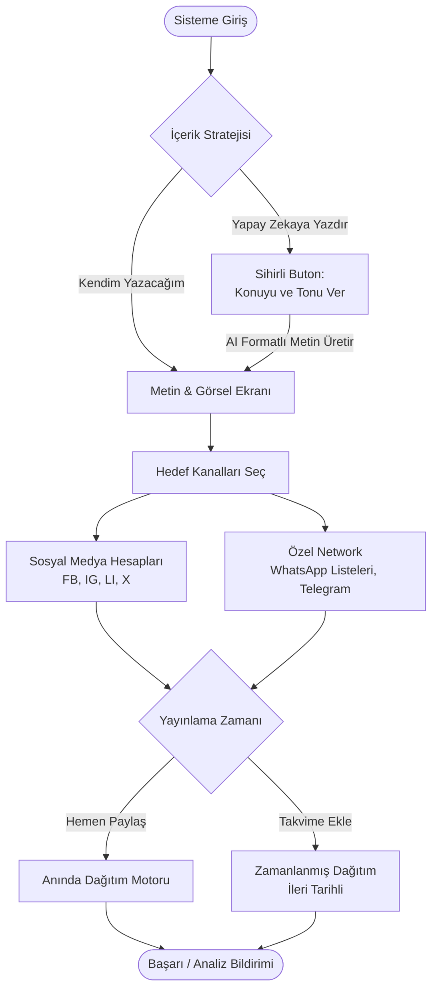

# 🚀 ALFA PUBLISHER: Proje Modellemesi ve Yol Haritası

> [!TIP]
> **Piyasa Fırsatı (Gap in the Market)**
> Araştırmalarınızda çok doğru tespit ettiğiniz gibi, sektördeki rakipler (Hootsuite, Buffer, Plexorin) sadece *kurumsal sosyal medya* metriklerine odaklanırken; çok karışık arayüzler ve epey yüksek fiyatlar sunuyorlar. Bireysel girişimcilerin, KOBİ'lerin veya danışmanların "Toplu WhatsApp Duyurusu", "Telegram Grubu" ve "Instagram/LinkedIn" hesaplarına **tek bir kolay ekrandan, yapay zeka ile içerik üretip** anında gönderebileceği bir "Kişisel Network Yayıncısı" piyasada devasa bir boşluktur. Bu, tam bir mavi okyanus stratejisidir.

---

## 1. Sistem Mimari Modellemesi (Architecture)

Alfa Publisher, hem web üzerinde hem de cep telefonunda (iOS/Android) eşzamanlı ve tam senkronize çalışacak hibrit bir yapı olarak modellenebilir.

---

## 2. Kullanıcı Akışı (Flow-Chart)

Kullanıcının uygulamaya girip tüm network'üne yayın yapma serüveni olabildiğince **aptal kanıtı (fool-proof)** ve dev şirketlerin aksine karmaşıklıktan uzak tasarlanmıştır.

---

## 3. Geliştirme Yol Haritası (Roadmap)

Projeyi masaüstünden çıkarıp milyar dolarlık bir SaaS ekosistemine dönüştürmek için 4 temel faza ayırdığımız bir vizyon stratejisi:

### Faz 1: "Çekirdek" Web-App & Sosyal Medya MVP (1. - 2. Ay)
- Ekranınızdaki Alfa Yapay Zeka projesinin çekirdek mimarisinin bir kolu olarak **Web-App** arayüzünün oluşturulması.
- Kullanıcı üyelik (Auth) panellerinin kurulumu.
- Gönderileri tek tıkla büyüleyici hale getirmesi için **Yapay Zeka (ChatGPT/Gemini API)** prompt asistanının uygulamaya gömülmesi.
- Temel Sosyal Medya API'lerinin (Facebook, Instagram, LinkedIn) sisteme bağlanması.
- Takvim bazlı "İleri Tarihli Gönderi Planlayıcı" modülünün yazılması.

### Faz 2: "Kişisel Ağ" Devrimi - WhatsApp & Telegram (3. - 4. Ay)
- Sistemdeki esas ezber bozan teknolojimiz olan **WhatsApp Cloud API** (veya WhatsApp Web otomasyonları) entegrasyonu.
- Kullanıcıların kendi bağlantı listelerine (Excel yükleme veya direkt rehber seçimi) WhatsApp üzerinden toplu ama isimlerine özel kişiselleştirilmiş (Örn: *Merhaba Ali Bey...*) şablon mesajları gönderebilmesi.
- **Telegram Bot API** kurulumu ile markanın veya kişinin kendi özel Telegram gruplarına/kanallarına otomatik haber/post fırlatabilmesi.

### Faz 3: "Cepte Taşı" Mobile-App Çıkışı (5. - 6. Ay)
- Sektörde gerçekten ses getirecek adım: Ekran bağımlılığını kaldıran **React Native** teknolojisiyle hem iOS hem Android uygulamasının geliştirilmesi.
- *Kullanım Senaryosu:* Arabada giderken bir ilan çeken/fikir bulan kullanıcının, bu resmi uygulamaya atıp AI'a metni yazdırıp, anında "Tüm kanallarımda ve WhatsApp duyuru grubumda paylaş" diyebilme gücü.
- Kesintisiz mobil bildirimler altyapısının kurulması.

### Faz 4: Ticarileştirme, SaaS Abonelikleri ve Globalleşme (7. Ay ve Sonrası)
- Yaptığınız araştırmalardaki (Buffer, Hootsuite) pazar payından pay almak için Abonelik/Lisans/Kredi satış siteminin (Stripe/Iyzico) devreye alınması.
- Kurumsal olmayan ama iş yapan kesime özel, ucuz ama çok etklili rekabetçi fiyat planları oluşturulması (Örn: Sadece WhatsApp + Insta özellikli "Girişimci" paketi).
- Yayınlanan mesajların "Kaç WhatsApp kullanıcısı okudu, kaç Facebook etkileşimi aldı" gibi verilerini sunan sade bir İstatistik (Analytics) ekranı.

> [!WARNING]
> Hootsuite ve Plexorin gibi firmaların temel handikapı, sistemlerinin "bürokrasiyle" dolu olmasıdır (Onay süreçleri, binlerce gereksiz menü, karmaşık grafikler). **Alfa Publisher'ın** temel vurucu gücü ve mottosu *"Hesapları Bağla -> Çek/Yaz -> Yapay Zekaya Düzenlet -> Her Yere Ateşle"* sadeliği üzerine kurulacaktır.
